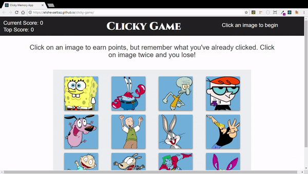

# Clicky Game

## Overview

This application is a memory game using React. This application breaks up it's UI into components, manages component state, and responds to user events.

Try out the game [here](https://elishevaelbaz.github.io/clicky-game/ "GitHub Pages link")

## Game Play

1. The application renders different images to the screen. Each image listens for click events.

2. The application keeps track of the user's score. When the user clicks on an image for the first time, their score is incremented. The user's is reset to 0 if they click the same image more than once.

3. Every time an image is clicked, the images rendered to the page shuffle themselves in a random order.

4. Once the user's score is reset after an incorrect guess, the game restarts.

- - -

